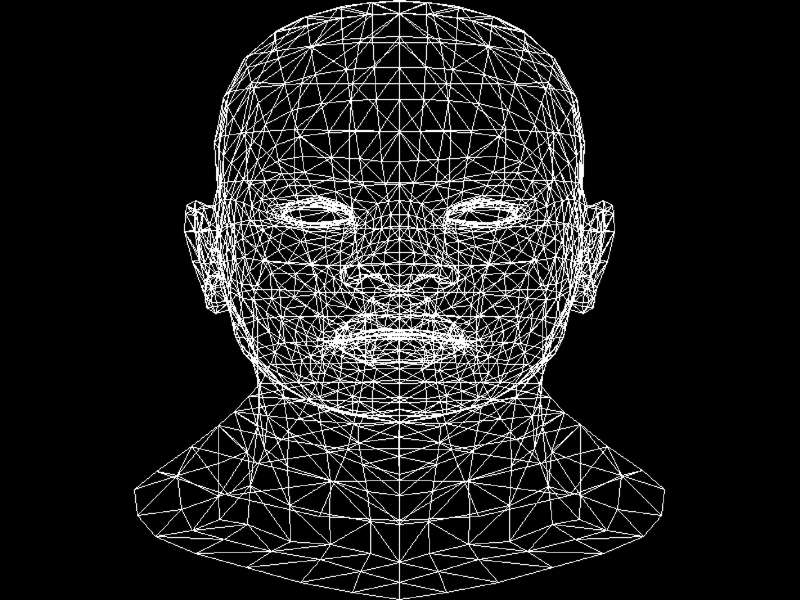
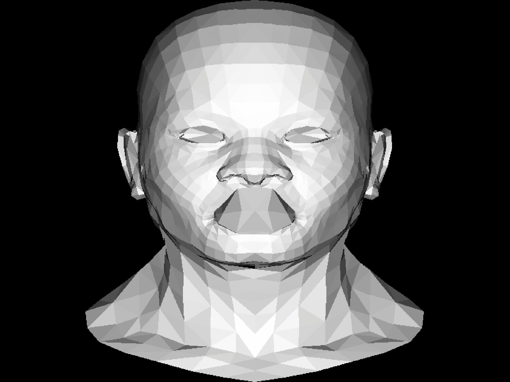
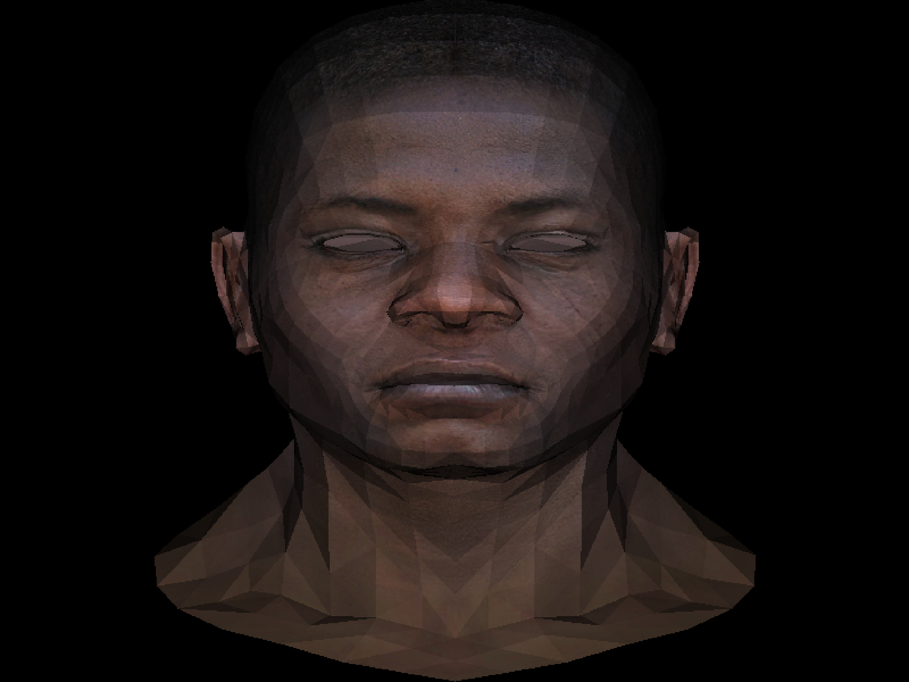

# Renders 3D To tga file

The renderer was written in C++ only. It reads the .obj file and writes the rendered result to the tga file. It uses a texture, a z-buffer, and a simple light.

**Wireframe**

**Polygons**

**Z-buffer**

**Texture**
